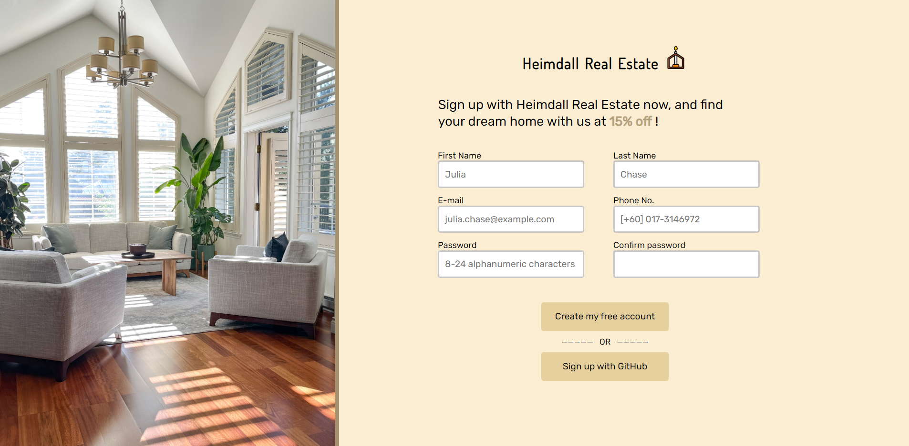

# Odin Form

This is a simple Sign-up Form.

## Live Preview

This project is hosted on **GitHub Pages**. Feel free to [:point_right: try it out](https://raineedust.github.io/sign-up-form/)!

## Motivation and Goals

- [x] Implement form structure
- [x] Implement side hero image
- [x] Implement form headings
- [x] Implement form body
- [x] Implement buttons
- [x] Implement with CSS variables
- [x] Implement HTML form validation
- [x] Implement password confirmation validation with JS
- [x] Make it pretty!

## Limitations

- No border indicator when using password regex.

## Resources

Below are a collection of resources which helped improve my skills :sparkles: while building the project:

- [html - I need an unordered list without any bullets - Stack Overflow](https://stackoverflow.com/questions/1027354/i-need-an-unordered-list-without-any-bullets)
- [CSS Forms](https://www.w3schools.com/css/css_form.asp)
- [html - Make buttons the same width without specifying the exact size - Stack Overflow](https://stackoverflow.com/questions/13483331/make-buttons-the-same-width-without-specifying-the-exact-size)
- [Regex for Alphanumeric Strings – RegexLand](https://regexland.com/regex-for-alphanumeric-strings/)
- [javascript - Regex pattern for Malaysian mobile phone Number - Stack Overflow](https://stackoverflow.com/questions/45406613/regex-pattern-for-malaysian-mobile-phone-number)
- [Regex for phone number - iHateRegex](https://ihateregex.io/expr/phone/)
- [CSS Styling Links](https://www.w3schools.com/css/css_link.asp)
- [The Complete Guide to HTML Forms and Constraint Validation - SitePoint](https://www.sitepoint.com/html-forms-constraint-validation-complete-guide/)

Built with :heart: to **The Odin Project**, a wonderful Web Development curriculum ~
